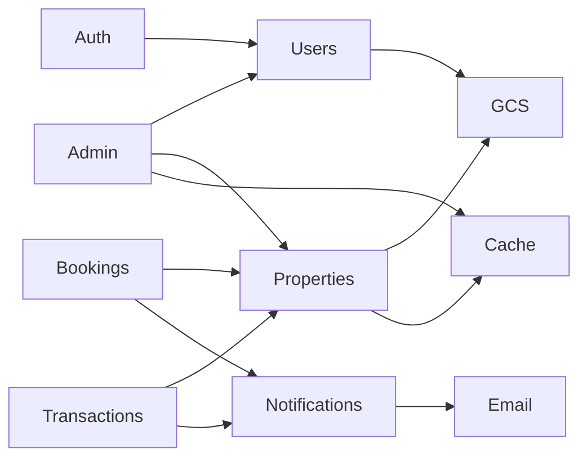

# Buytly Architecture

## System Overview

Buytly is a modular real estate marketplace backend built with Node.js, Express, and MongoDB. It follows clean architecture principles with strict separation between controllers (HTTP), services (business logic), models (data), and validation (Zod).

## Directory Structure

```
server/src/
├── modules/          # Domain modules (auth, users, properties, etc.)
├── shared/           # ApiResponse, AppError, constants, pagination
├── config/           # env, db, redis, swagger, swagger.schemas
├── middleware/       # auth, validate, sanitize, errorHandler, rateLimit
├── services/         # Cross-cutting services (GCS, email, cache, tokens)
├── utils/            # Helpers (asyncHandler, pick, slugify)
├── routes/           # Route aggregator
├── app.js            # Express app configuration
└── server.js         # Bootstrap & graceful shutdown
```

Each module contains:

- `*.model.js` — Mongoose schema
- `*.validation.js` — Zod schemas
- `*.service.js` — Business logic
- `*.controller.js` — HTTP handlers
- `*.routes.js` — Routes + Swagger annotations (`operationId`, request/response schemas)
- `config/swagger.schemas.js` — Shared OpenAPI components (schemas, parameters, error responses)

## Module Interactions



## Request Lifecycle

1. **Ingress** — Helmet, CORS, rate limit, body parsing, mongo sanitize
2. **Routing** — `/api/v1/{module}` matched to module router
3. **Auth** — JWT verified via `authenticate` middleware (where required)
4. **Validation** — Zod schemas validate body/query/params; parsed query/params are merged in-place (Express 5 compatible)
5. **Controller** — Thin handler delegates to service
6. **Service** — Business logic, DB queries, external service calls
7. **Response** — Unified `{ success, message, data }` format
8. **Error** — Centralized error handler catches all errors

## Data Flow Examples

### Media Upload

```
Client → Multer (memory) → GCS Service → MongoDB (metadata only) → Signed URL response
```

### Booking Flow

```
Buyer → POST /bookings → Property validation → Booking created → Notification (in-app + email) → Agent
Agent → PATCH /bookings/:id/status → Status update → Notification to buyer
```

### Transaction Flow

```
Buyer → POST /transactions → Property validation → Transaction created → Notify seller/agent
Seller/Agent → PATCH status → On complete, property status updated to sold/rented
```

## Scalability Considerations

- **Stateless API** — JWT access tokens enable horizontal scaling
- **Optional Redis** — Property list and analytics caching
- **MongoDB indexes** — Optimized for price, geo, type, status queries
- **GCS media** — Offloads file storage from application servers
- **Module independence** — Each domain module can evolve independently
