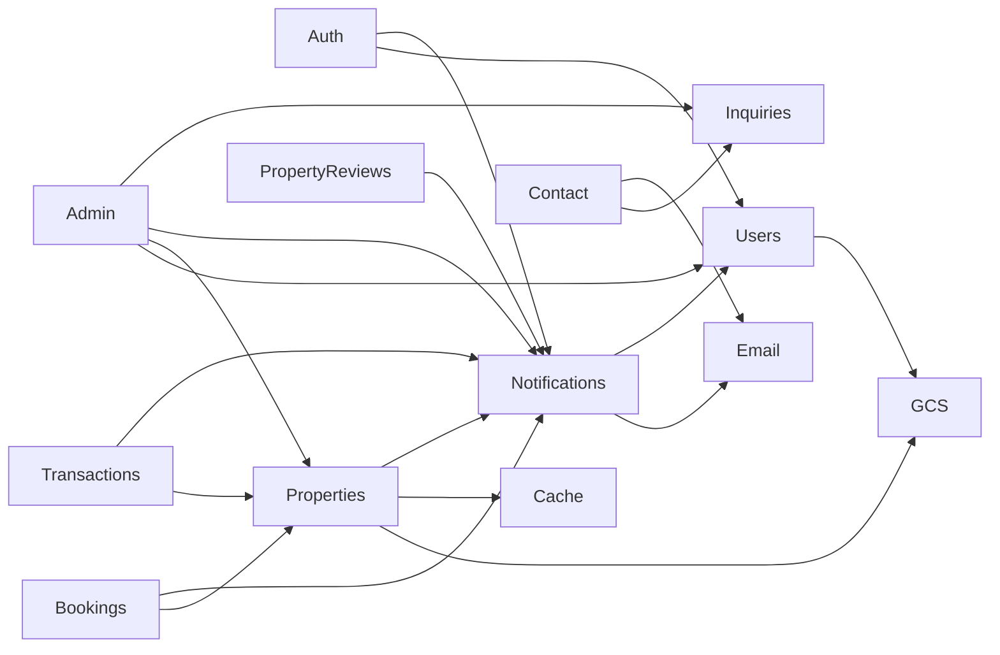

# Buytly Architecture

## System Overview

Buytly is a modular real estate marketplace backend built with Node.js, Express, and MongoDB. It follows clean architecture principles with strict separation between controllers (HTTP), services (business logic), models (data), and validation (Zod).

## Directory Structure

```
server/src/
├── modules/          # Domain modules (auth, users, properties, etc.)
├── shared/           # ApiResponse, AppError, constants, pagination
├── config/           # env, db, swagger, swagger.schemas
├── middleware/       # auth, validate, sanitize, errorHandler, rateLimit
├── services/         # Cross-cutting services (GCS, image, email, email.templates, siteBrand, cache, tokens)
├── utils/            # Helpers (asyncHandler, pick, slugify)
├── routes/           # Route aggregator
├── app.js            # Express app configuration
└── server.js         # Bootstrap & graceful shutdown
```

Each module contains:

- `*.model.js` — Mongoose schema
- `*.validation.js` — Zod schemas
- `*.service.js` — Business logic
- `*.controller.js` — HTTP handlers
- `*.routes.js` — Routes + Swagger annotations (`operationId`, request/response schemas)
- `config/swagger.schemas.js` — Shared OpenAPI components (schemas, parameters, error responses)

## Module Interactions


```mermaid
flowchart LR
  Auth --> Users
  Users --> GCS
  Properties --> GCS
  Properties --> Cache
  Bookings --> Properties
  Bookings --> Notifications
  Transactions --> Properties
  Transactions --> Notifications
  Admin --> Users
  Admin --> Properties
  Properties --> Notifications
  PropertyReviews --> Notifications
  Auth --> Notifications
  Admin --> Notifications
  Contact --> Inquiries
  Contact --> Email
  Admin --> Inquiries
  Notifications --> Email
  Notifications --> Users
```

## Request Lifecycle

1. **Ingress** — Helmet, CORS, rate limit, body parsing, mongo sanitize
2. **Tenant** — `resolveSite` resolves the site from host/headers, sets `req.site`, and runs the rest of the request in AsyncLocalStorage (`getRequestSiteId()` / `getRequestSite()`). Multer upload handlers call `bindSiteContext` after parsing so site context is restored before GCS paths and tenant-scoped queries run. Domain services filter and write by `siteId` unless a platform admin overrides via `siteId` query on admin list endpoints.
3. **Routing** — `/api/v1/{module}` matched to module router
4. **Auth** — JWT verified via `authenticate` middleware (where required); user and token `siteId` must match the resolved site
5. **Validation** — Zod schemas validate body/query/params; parsed query/params are merged in-place (Express 5 compatible)
6. **Controller** — Thin handler delegates to service
7. **Service** — Business logic, DB queries, external service calls
8. **Response** — Unified `{ success, message, data }` format
9. **Error** — Centralized error handler catches all errors

## Data Flow Examples

### Media Upload

```
Client → Multer (memory) → bindSiteContext → image.service (compress if > 800 KB) → GCS Service → MongoDB (metadata only) → Signed URL response
```

Images above 800 KB are resized and compressed to WebP (max 800 KB) before upload. Images at or below 800 KB, GIFs, and videos are stored as-is.

### Booking Flow

```
Buyer → POST /bookings → Property validation → Booking created → notificationService.notifyFromEvent("booking.created") → Agent (in-app + email per preferences)
Agent → PATCH /bookings/:id/status → Status update → notifyFromEvent("booking.status_updated") → Buyer
Buyer cancel → notifyFromEvent("booking.cancelled") → Agent
```

### Contact Inquiry Flow

```
Visitor → POST /contact → Zod validation → honeypot (`website` filled → 201, nothing stored)
  → Inquiry saved (request siteId; unitId kept only if the unit is on the same site)
  → email.service: inbox (site branding.contactInboxEmail || CONTACT_INBOX_EMAIL) → emailDelivered = true → auto-reply to submitter (Reply-To: site branding.supportEmail)
  → 201 (email failures are logged, the inquiry is kept)
Admin → GET /admin/inquiries, PATCH /admin/inquiries/:id → always scoped to the request site (no platform-admin siteId override)
```

### Transaction Flow

```
Buyer → POST /transactions → Property validation → Transaction created → notifyMany("transaction.created") → seller/agent
Seller/Agent → PATCH status → notifyMany("transaction.status_updated") → buyer, seller, agent; on complete, property status updated to sold; when every non-trashed unit on the project is sold the parent project becomes `sold` and the owner receives `project.status_changed`; same project sync runs when a unit is marked sold (dashboard or admin); marking the project sold cascades all live units to sold; property list cache invalidated
Property review → notifyMany("review.received") → owner/agent (excluding reviewer)
Listing submit/resubmit → notifyMany("property.pending_review") → admins
Admin moderate → notifyFromEvent("property.status_changed") → owner
Auth register → notifyFromEvent("auth.welcome"); verify email → auth.email_verified; change password → auth.password_changed
```

## Email delivery

`email.service.js` renders templates from `email.templates.js` and sends via:

- **`EMAIL_PROVIDER=smtp`** (default) — Nodemailer + Gmail or any SMTP relay
- **`EMAIL_PROVIDER=sendgrid`** — `@sendgrid/mail` API using `SENDGRID_API_KEY` and `SMTP_FROM` as the verified sender

Test env skips network send entirely.

### Per-site branding

Every email is sent inside an HTTP request, so `services/siteBrand.js` reads the request site (`getRequestSite()`) and `email.service` passes the brand to the templates:

| Field          | Request site                                                                                | No request site (scripts, unit tests) |
| -------------- | ------------------------------------------------------------------------------------------- | ------------------------------------- |
| `name`         | `branding.siteDisplayName` → `name`                                                         | `Buytly`                              |
| `url`          | `resolveSitePublicBaseUrl(site)` (`SITE_PUBLIC_URL_*` → dev default → `sites.publicUrl`)    | `APP_URL`                             |
| `supportEmail` | `branding.supportEmail` (may be empty)                                                      | `CONTACT_INBOX_EMAIL`                 |

- **Templates** (`email.templates.js`) take `{ brand, ...params }`; `brand.name` replaces the product name in subjects, header, body and footer (`Buytly` only when no brand is passed). Layout and colours are shared by all sites.
- **Sender** — the address is `SMTP_FROM`, which must be a plain email address (`env.js` rejects `Name <addr>` at startup), and the display name is the brand, e.g. `Block 57 <noreply@…>`, for both SMTP and SendGrid.
- **Reply-To** — the contact auto-reply uses the site's `branding.supportEmail` when set; the inbox email keeps the submitter.
- **Links** — verify/reset links (`auth.service`) and notification CTAs use `buildSiteLink(path)` = site public base URL (or `APP_URL`) + path, so tenant users land on their own site. Catalog events return a relative `ctaPath`; `buildNotificationPayload` prefixes the base once. The `auth.welcome` title names the site (`Welcome to Block 57`).
- Within a request, notification emails only reach users of the request site (`notify()` looks users up by request `siteId`; cross-site moderation drops them), so the brand always matches the recipient's site. Without a request site the Buytly fallback applies.

## Database seeding

`scripts/seed.js` (`npm run seed`, `npm run seed:reset`) loads demo users, agent profiles, projects with sellable units across Dubai/Abu Dhabi/Sharjah (including land, archived, sold/pending/draft statuses and map coordinates), reviews, favorites, bookings, buy-only transactions, saved searches, and notifications.

**Listing catalog:** `seed:reset` clears and repopulates `propertytypecatalogs` and `amenitycatalogs` (defaults from `src/modules/catalog/catalog.defaults.js` plus demo-only amenities in `scripts/seed/catalog.js`). Demo properties use **USD** and amenity strings that exist in that catalog so they match API validation. Non-reset seed upserts missing demo amenities when types already exist.

**Fixture data** (users, property titles, coordinates) lives in `scripts/seed/catalog.js` — not to be confused with the runtime **catalog module** (`src/modules/catalog/`). Smoke test: `tests/seed.test.js`.

**Block 57 tenant bootstrap:** `scripts/seed-block57.js` (`npm run seed:block57`; CLI) wraps `seedBlock57()` in `scripts/seed/block57.js`. Unlike the demo seed it is meant for production and safe to re-run (upserts only, nothing deleted). It runs inside `runWithRequestContext({ site: block57 })` and reuses the services, so the API's rules apply: `projectService.create`, `propertyService.create`/`update` (catalog validation, slugs, project location, sold-project sync) and `adminService.moderateProject` for `--activate`. Steps and the units file format: `deployment.md`. Tests: `tests/seed-block57.test.js`.

## GCS orphan cleanup

Media keys live in MongoDB (`users.avatar`, `properties.media`, `properties.floorPlans`, `projects.media`). Orphaned bucket objects are removed by `scripts/gcs-orphan-cleanup.js` (`npm run cleanup:gcs`, `--dry-run` supported). All uploads use `sites/{siteSlug}/avatars|properties|projects/...` via `buildSiteFolder()`. Deployments that predate multi-site may still have legacy flat keys (`avatars/`, `projects/`, `properties/`) in MongoDB and GCS — run `npm run migrate:gcs-site-prefix` once (see `deployment.md`) to copy objects and rewrite keys; flat prefixes are deprecated after that migration. Orphan cleanup scans both legacy and `sites/` prefixes until cleanup has removed stragglers; unreferenced objects older than `GCS_ORPHAN_GRACE_HOURS` (default 48) are deleted.

## Scalability Considerations

- **Stateless API** — JWT access tokens enable horizontal scaling
- **MongoDB indexes** — Optimized for price, geo, type, status queries
- **GCS media** — Offloads file storage from application servers
- **Module independence** — Each domain module can evolve independently
