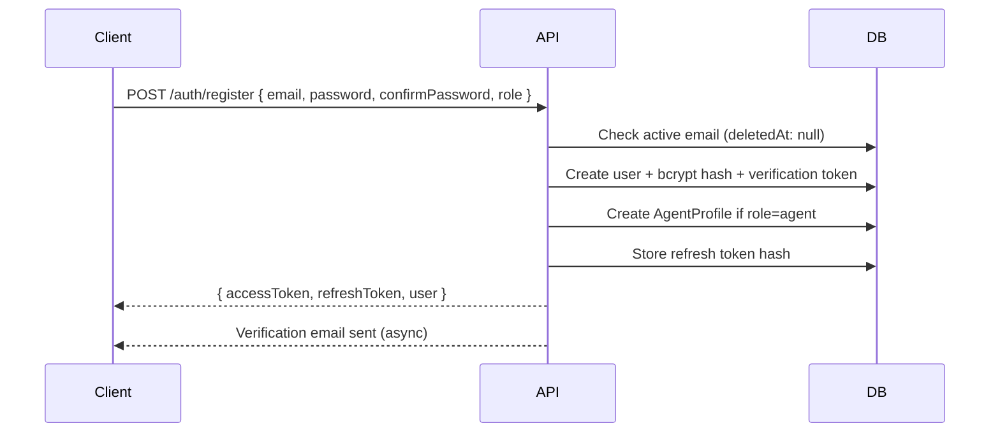
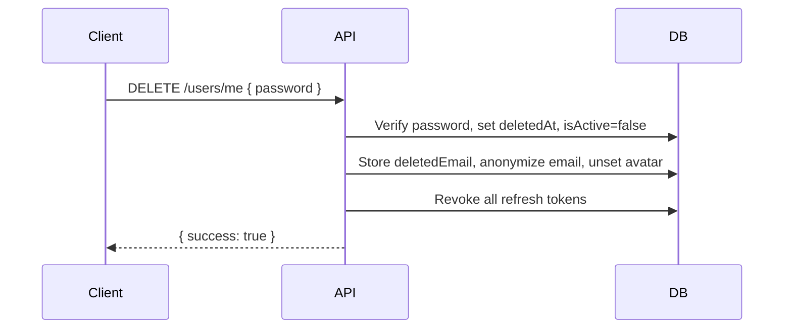
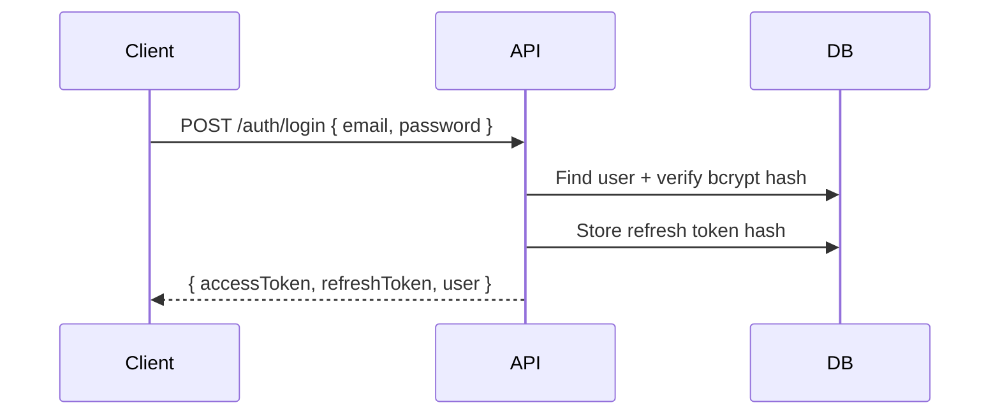
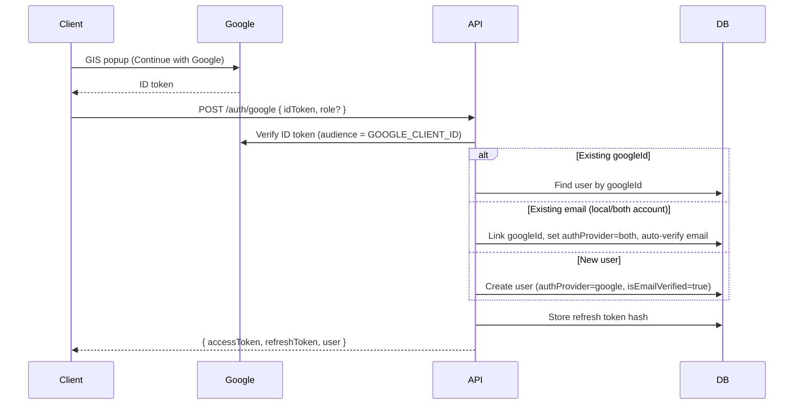
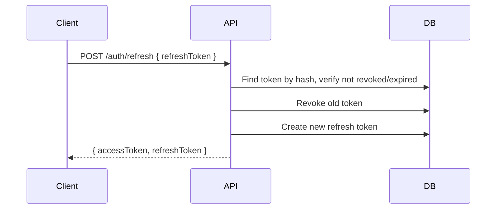
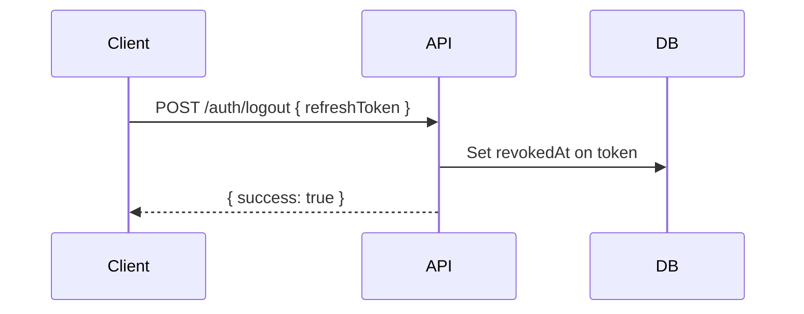

# Authentication Flow

## JWT Lifecycle

Buytly uses a dual-token authentication system:

- **Access Token** — Short-lived JWT (default 15m), stateless, sent in `Authorization: Bearer` header
- **Refresh Token** — Opaque UUID stored hashed in MongoDB (default 7d), used to obtain new token pairs

### Access Token Payload

```json
{
  "sub": "userId",
  "role": "buyer",
  "iat": 1234567890,
  "exp": 1234568790
}
```

## Register Flow



- `confirmPassword` must match `password` (validated server-side; clients may also validate locally)
- Role defaults to `buyer`; `admin` cannot be self-assigned
- Duplicate active emails return `409`
- Soft-deleted accounts free the email for re-registration (partial unique index on `email` where `deletedAt` is null)

## Email Verification Flow

1. On registration, server stores SHA-256 hash of verification token (24h expiry) and sends link: `{APP_URL}/verify-email?token={token}`
2. User submits token via `POST /auth/verify-email`
3. Unverified users can still log in; `isEmailVerified` is exposed on the user object for client-side prompts
4. Resend via `POST /auth/resend-verification` (generic response to avoid email enumeration)

## Account Deletion Flow



- Soft delete only — user record and all related data (properties, bookings, transactions, reviews, favorites) are **retained** for admin audit
- **Listings stay live** — account deletion does not change property status or archive listings
- Avatar file removed from GCS and `avatar` field unset on the user document
- Original email stored in `deletedEmail` for admin lookup; public `email` anonymized to `deleted_<id>@deleted.buytly.internal`
- Password hash overwritten on deletion; verification/reset tokens cleared
- Same email can register again after deletion (partial unique index on active users)
- Admins can list deleted users via `GET /admin/users?deleted=true` and inspect detail via `GET /admin/users/:id`

## Login Flow



## Google Sign-In Flow

Uses [Google Identity Services](https://developers.google.com/identity/gsi/web) on the client. The browser obtains a Google **ID token** (JWT); the API verifies it with `google-auth-library` and issues the same Buytly access/refresh token pair as email login.



- `role` is optional and only applied on **first** Google sign-up (defaults to `buyer`; `agent` creates an `AgentProfile`)
- Google users have no local password until they set one via password reset; `authProvider` is `google` or `both` when linked
- Email/password accounts with the same verified Google email are **auto-linked** on Google sign-in — user can then sign in with either method
- Google sign-in auto-verifies the account when Google confirms the email (`isEmailVerified=true`, verification tokens cleared)
- Google-only accounts cannot change password until a password is set via reset; after reset, `authProvider` becomes `both` and password login/change-password are available

**Env:** `GOOGLE_CLIENT_ID` (server) and `NEXT_PUBLIC_GOOGLE_CLIENT_ID` (client) must match the OAuth Web client ID. Add the app origin (e.g. `http://localhost:3000`) under **Authorized JavaScript origins** in Google Cloud Console.

## Refresh Token Rotation

Every refresh request rotates the token — the old token is revoked and a new pair is issued. This prevents replay attacks with stolen refresh tokens.



## Logout Flow



## Password Reset Flow

1. User submits email via `POST /auth/forgot-password`
2. Server generates crypto-random token, stores SHA-256 hash in user document (1h expiry)
3. Email sent with reset link: `{APP_URL}/reset-password?token={token}`
4. User submits token + new password via `POST /auth/reset-password`
5. Password updated, all refresh tokens revoked

## Change Password Flow (authenticated)

1. User submits `currentPassword`, `newPassword`, and `confirmNewPassword` via `POST /auth/change-password`
2. Server verifies current password with bcrypt
3. Password hash updated; user remains logged in (refresh tokens are not revoked)

## Role Permissions Matrix

| Action                | buyer | seller | agent | admin |
| --------------------- | ----- | ------ | ----- | ----- |
| View properties       | Yes   | Yes    | Yes   | Yes   |
| Create listings       | —     | Yes    | Yes   | Yes   |
| Manage own listings   | —     | Yes    | Yes   | Yes   |
| Favorites             | Yes   | Yes    | Yes   | Yes   |
| Request bookings      | Yes   | —      | —     | —     |
| Approve bookings      | —     | Yes\*  | Yes   | Yes   |
| Initiate transactions | Yes   | —      | —     | —     |
| Approve transactions  | —     | Yes    | Yes   | Yes   |
| Agent profile         | —     | —      | Yes   | Yes   |
| Admin panel           | —     | —      | —     | Yes   |
| User management       | —     | —      | —     | Yes   |
| Listing moderation    | —     | —      | —     | Yes   |
| Analytics             | —     | —      | —     | Yes   |

\* Seller can approve bookings when they are the assigned listing contact (`agentId` on the booking, typically the owner when no agent is set on the property).

## Property visibility and moderation

- Public `GET /properties` returns **active** listings by default. Public list `status` filter accepts only `active`, `sold`, or `rented`.
- Public `GET /properties/:id` returns **404** for non-active listings unless the requester is the owner, assigned agent, or admin (optional auth).
- Non-admin create/update: `status: "active"` → **`pending`**. Omitting `status` on PATCH keeps the current status. Non-admins cannot set `sold`/`rented`/`archived` directly.
- Pending submissions notify admins; admin moderation notifies the owner.

## Security Measures

- Passwords hashed with bcrypt (12 salt rounds)
- Refresh tokens stored as SHA-256 hashes (never plaintext)
- Password reset tokens hashed in database
- Email verification tokens hashed in database
- All refresh tokens revoked on password reset and account deletion
- Rate limiting on auth endpoints (20 req/15min)
- JWT secrets validated at startup (min 32 chars)
