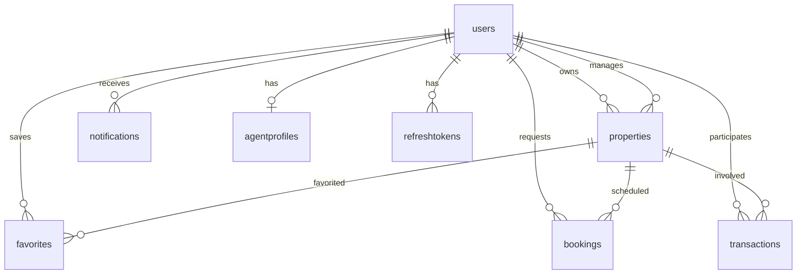

# Database Schema

## Collections Overview

| Collection    | Module        | Description                |
| ------------- | ------------- | -------------------------- |
| users         | Users         | User accounts and profiles |
| refreshtokens | Auth          | JWT refresh token store    |
| properties    | Properties    | Property listings          |
| agentprofiles | Agents        | Agent profile extensions   |
| favorites     | Favorites     | User saved properties      |
| bookings      | Bookings      | Visit scheduling           |
| transactions  | Transactions  | Buy/rent tracking          |
| notifications | Notifications | In-app notifications       |

## users

```javascript
{
  email: String (unique among active users — partial index where deletedAt is null),
  passwordHash: String,
  role: enum [buyer, seller, agent, admin],
  firstName, lastName, phone: String,
  phoneCountryCode, phoneNumber: String (E.164 parts; `phone` kept as combined),
  avatar: { gcsKey, mimeType, size } — stored in GCS; API responses add a signed `url` at read time (not persisted).
  socialLinks: { instagram, linkedin, website },
  preferences: { budgetMin, budgetMax, locations[], propertyTypes[] },
  savedSearches: [{ name, filters, createdAt }],
  isActive: Boolean,
  isEmailVerified: Boolean,
  emailVerificationToken, emailVerificationExpires: String/Date,
  passwordResetToken, passwordResetExpires: String/Date,
  deletedAt: Date (soft delete),
  timestamps
}
```

**Indexes:** `email` (partial unique where `deletedAt` is null), `role`, `deletedAt`

## refreshtokens

```javascript
{
  userId: ObjectId → users,
  tokenHash: String (unique),
  expiresAt: Date (TTL index),
  revokedAt: Date,
  replacedByToken: String
}
```

## properties

```javascript
{
  title, slug (unique), description: String,
  type: enum [apartment, villa, townhouse, land, commercial, duplex, studio],
  listingType: enum [sale, rent],
  price: Number, currency: String,
  location: {
    type: Point,
    coordinates: [lng, lat],
    address, city, country
  },
  bedrooms, bathrooms, area, areaUnit: Number/String,
  amenities: [String],
  status: enum [draft, pending, active, sold, rented, archived],
  media: [{ gcsKey, type, order, mimeType, size }],
  agentId: ObjectId → users,
  ownerId: ObjectId → users,
  viewCount: Number,
  deletedAt: Date,
  timestamps
}
```

**Indexes:**

- `location` — 2dsphere
- `price`, `type`, `status`
- `{ listingType, status, price }` — compound
- `{ title, description }` — text

## agentprofiles

```javascript
{
  userId: ObjectId → users (unique),
  licenseNumber, agency, bio: String,
  specialties: [String],
  city: String,
  rating: Number (0-5),
  reviewCount: Number,
  isVerified: Boolean,
  timestamps
}
```

## favorites

```javascript
{
  userId: ObjectId → users,
  propertyId: ObjectId → properties,
  createdAt: Date
}
```

**Indexes:** `{ userId, propertyId }` (unique), `{ userId, createdAt }`

## bookings

```javascript
{
  propertyId: ObjectId → properties,
  buyerId: ObjectId → users,
  agentId: ObjectId → users,
  scheduledAt: Date,
  message: String,
  status: enum [pending, approved, rejected, cancelled, completed],
  agentNotes: String,
  timestamps
}
```

## transactions

```javascript
{
  propertyId: ObjectId → properties,
  buyerId, sellerId, agentId: ObjectId → users,
  type: enum [buy, rent],
  amount: Number, currency: String,
  status: enum [pending, approved, completed, cancelled],
  notes: String,
  completedAt: Date,
  timestamps
}
```

## notifications

```javascript
{
  userId: ObjectId → users,
  type: enum [booking, transaction, property, system, auth],
  title, message: String,
  data: Mixed,
  isRead: Boolean,
  readAt: Date,
  channels: { inApp, email },
  timestamps
}
```

## Relationships


