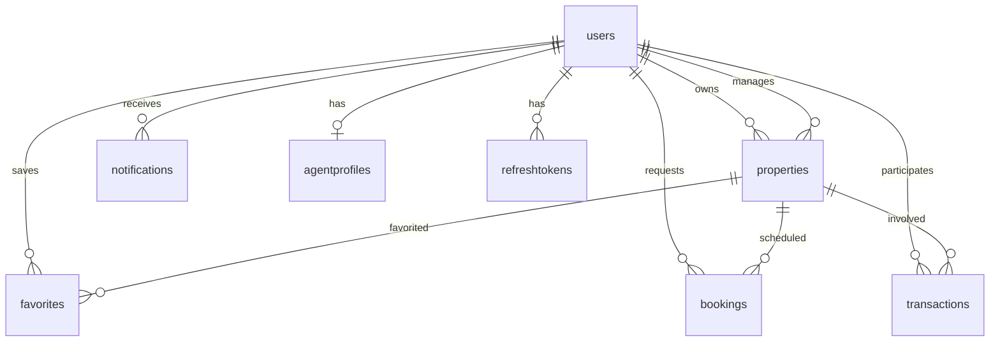

# Database Schema

## Collections Overview

| Collection           | Module           | Description                                     |
| -------------------- | ---------------- | ----------------------------------------------- |
| users                | Users            | User accounts and profiles                      |
| refreshtokens        | Auth             | JWT refresh token store                         |
| projects             | Projects         | Development projects (shared marketing + units) |
| properties           | Properties       | Sellable units (listings)                       |
| propertyreviews      | Property Reviews | Property listing reviews                        |
| agentprofiles        | Agents           | Agent profile extensions                        |
| favorites            | Favorites        | User saved properties                           |
| bookings             | Bookings         | Visit scheduling                                |
| transactions         | Transactions     | Purchase tracking                               |
| notifications        | Notifications    | In-app notifications                            |
| propertytypecatalogs | Catalog          | Admin-managed property types                    |
| amenitycatalogs      | Catalog          | Admin-managed amenities                         |

## users

```javascript
{
  email: String (unique among active users — partial index where deletedAt is null),
  authProvider: enum [local, google, both] (default local),
  googleId: String (partial unique where deletedAt is null and googleId is set),
  passwordHash: String (required when authProvider is local),
  role: enum [buyer, seller, agent, admin],
  firstName, lastName, phone: String,
  phoneCountryCode, phoneNumber: String (E.164 parts; `phone` kept as combined),
  avatar: { gcsKey, mimeType, size } — stored in GCS; API responses add a signed `url` at read time (not persisted).
  socialLinks: { instagram, linkedin, website },
  preferences: { budgetMin, budgetMax, locations[], propertyTypes[] },
  notificationPreferences: {
    email: { booking, transaction, property, auth, system } (default true),
    inApp: { booking, transaction, property, auth, system } (default true)
  },
  savedSearches: [{ name, filters, createdAt }],
  isActive: Boolean,
  isEmailVerified: Boolean,
  emailVerificationToken, emailVerificationExpires: String/Date,
  passwordResetToken, passwordResetExpires: String/Date,
  deletedAt: Date (soft delete),
  deletedEmail: String (original email retained for admin when soft-deleted),
  timestamps
}
```

**Indexes:** `email` (partial unique where `deletedAt` is null), `googleId` (partial unique where `deletedAt` is null), `role`, `deletedAt`

**Account deletion:** Sets `deletedAt`, clears avatar from GCS and document, anonymizes `email`, stores prior address in `deletedEmail`. Does **not** cascade to properties, bookings, transactions, reviews, or favorites — listings remain at their current status (including active/public).

## refreshtokens

```javascript
{
  userId: ObjectId → users,
  tokenHash: String (unique),
  expiresAt: Date (TTL index),
  revokedAt: Date,
  replacedByToken: String
}
```

## projects

```javascript
{
  title, slug (unique), description: String,
  location: {
    type: Point,
    coordinates: [lng, lat],
    address, city, country
  },
  amenities: [String],
  status: enum [draft, pending, active, sold, archived],
  media: [{ gcsKey, type, order, mimeType, size }],
  virtualTourUrl: String,
  agentId: ObjectId → users,
  ownerId: ObjectId → users,
  viewCount: Number,
  deletedAt: Date,
  timestamps
}
```

**Indexes:** `location` 2dsphere; `{ status, createdAt }`; text on title/description

**Publish rules:** ≥ 1 live (non-trashed) unit before publish (`pending`/`active`). Units go `pending` with the project; admin unit `active` requires parent project `active` or `sold`. Admin project moderate to `draft` demotes `active`/`pending` units on that project to `draft`. Completing a purchase transaction marks the unit `sold` and sets the parent project to `sold` when all non-trashed units on the project are sold. Archiving the last live unit on a project demotes `active`/`pending` parents to `draft`.

**Trash:** Seller/agent `DELETE` and admin project archive set `deletedAt` + `status: archived` on the project and **all** units (one shared timestamp). Restore reverses the project and matching units to `draft`. Per-unit restore is rejected while the parent project remains trashed. Sellers cannot edit units under a trashed parent.

## properties

Sellable **units** under a project. All listings are for **sale** (no `listingType`).

```javascript
{
  projectId: ObjectId → projects (required),
  sortOrder: Number,
  title, slug (unique), description: String,
  type: String (catalog slug),
  price: Number (whole USD), currency: String (USD),
  location: copied from project (GeoJSON Point + address fields),
  bedrooms, bathrooms, area, areaUnit,
  amenities: [String],
  status: enum [draft, pending, active, sold, archived],
  media, floorPlans (`{ title, gcsKey }` per level, any property type), virtualTourUrl,
  agentId, ownerId, viewCount, deletedAt, timestamps
}
```

**Indexes:** `location` 2dsphere; `price`, `type`, `status`; `{ status, price }`; `{ projectId, sortOrder }`; text on title/description

## agentprofiles

```javascript
{
  userId: ObjectId → users (unique),
  licenseNumber, agency, bio: String,
  specialties: [String],
  city: String,
  rating: Number (0-5),
  reviewCount: Number,
  isVerified: Boolean,
  timestamps
}
```

## favorites

```javascript
{
  userId: ObjectId → users,
  propertyId: ObjectId → properties,
  createdAt: Date
}
```

**Indexes:** `{ userId, propertyId }` (unique), `{ userId, createdAt }`

## propertyreviews

```javascript
{
  propertyId: ObjectId → properties,
  userId: ObjectId → users,
  rating: Number (1-5),
  title: String,
  text: String,
  timestamps
}
```

**Indexes:** `{ propertyId, userId }` (unique), `{ propertyId, createdAt }`

## bookings

```javascript
{
  propertyId: ObjectId → properties,
  buyerId: ObjectId → users,
  agentId: ObjectId → users,
  scheduledAt: Date,
  message: String,
  status: enum [pending, approved, rejected, cancelled, completed],
  agentNotes: String,
  timestamps
}
```

## transactions

```javascript
{
  propertyId: ObjectId → properties,
  buyerId, sellerId, agentId: ObjectId → users,
  type: enum [buy],
  amount: Number, currency: String,
  status: enum [pending, approved, completed, cancelled],
  notes: String,
  completedAt: Date,
  timestamps
}
```

## notifications

```javascript
{
  userId: ObjectId → users,
  type: enum [booking, transaction, property, system, auth],
  title, message: String,
  data: Mixed ({ event, entityType, entityId, propertyId, projectId, projectTitle, status, href }),
  isRead: Boolean,
  readAt: Date,
  channels: { inApp, email },
  timestamps
}
```

## propertytypecatalogs / amenitycatalogs

```javascript
{
  value: String (unique; slug for types, stored amenity string for amenities),
  label: String,
  sortOrder: Number,
  isActive: Boolean,
  timestamps
}
```

Seeded from `catalog.defaults.js` on first catalog API access: missing default rows are upserted (`$setOnInsert` only, so existing admin edits are kept). Bootstrap is single-flight per server process to avoid duplicate-key races under parallel requests.

**Default property types:** apartment, villa, duplex, penthouse, townhouse, office, shop, building, land, chalet.

**Default amenities:** Parking, Elevator, Balcony, Terrace, Garden, Swimming Pool, Gym, Security, Generator, Central AC, Furnished, Sea View, Mountain View, Smart Home, Pet Friendly.

Protected property types (if any) cannot be edited, deleted, or deactivated via the admin catalog API.

## Relationships


