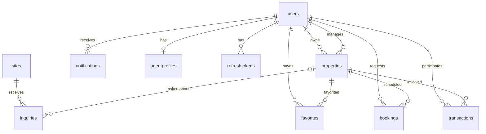

# Database Schema

## Collections Overview

| Collection           | Module           | Description                                     |
| -------------------- | ---------------- | ----------------------------------------------- |
| sites                | Sites            | Tenant registry (domains, branding, policies)   |
| users                | Users            | Per-site user accounts                          |
| refreshtokens        | Auth             | JWT refresh token store                         |
| projects             | Projects         | Development projects (shared marketing + units) |
| properties           | Properties       | Sellable units (listings)                       |
| propertyreviews      | Property Reviews | Property listing reviews                        |
| agentprofiles        | Agents           | Agent profile extensions                        |
| favorites            | Favorites        | User saved properties                           |
| bookings             | Bookings         | Visit scheduling                                |
| transactions         | Transactions     | Purchase tracking                               |
| notifications        | Notifications    | In-app notifications                            |
| inquiries            | Contact / Admin  | Per-site contact form submissions               |
| propertytypecatalogs | Catalog          | Admin-managed property types                    |
| amenitycatalogs      | Catalog          | Per-site admin-managed amenities                |

## sites

Multi-tenant registry. One document per public site (Buytly platform + partner tenants such as Buildwise and Block 57).

```javascript
{
  slug: String (unique, e.g. buytly, buildwise, block57),
  kind: enum [platform, tenant],
  name: String,
  primaryDomain: String,
  domains: [String],
  publicUrl: String,
  branding: {
    supportEmail, supportPhone, supportPhoneDisplay,
    siteDisplayName, logoUrl, contactInboxEmail
  },
  platformListingPolicy: enum [optIn, defaultVisibleOnPlatform],
  features: Mixed (per-site flags, e.g. { hidePublicPrices: Boolean }),
  isActive: Boolean,
  timestamps
}
```

**Indexes:** `slug` (unique), `primaryDomain`, `domains`, `isActive`

**Seeding:** `siteService.ensureDefaultSites()` on API boot creates Buytly (`kind: platform`), Buildwise (`kind: tenant`) and Block 57 (`kind: tenant`, `block-57.com`, `contactInboxEmail: info@block-57.com`, `features.hidePublicPrices: true`). Entries are upserted with `$setOnInsert`, so an existing database gains a newly added site on the next boot and edits to existing sites are never overwritten.

**Feature flags (`features`):**

| Flag               | Type    | Description                                                                                                                                                                                                                                                                                         |
| ------------------ | ------- | --------------------------------------------------------------------------------------------------------------------------------------------------------------------------------------------------------------------------------------------------------------------------------------------------- |
| `hidePublicPrices` | Boolean | When `true`, API responses for this site's units and projects omit prices for viewers who cannot manage the listing (unit `price: null`, project `priceMin`/`priceMax: null`, plus `priceLabel: "Price on request"`). Stored prices are unchanged. See [api-rules.md](./api-rules.md#hidden-prices) |

## users

```javascript
{
  siteId: ObjectId → sites (required),
  email: String (unique per site among active users),
  authProvider: enum [local, google, both] (default local),
  googleId: String (partial unique where deletedAt is null and googleId is set),
  passwordHash: String (required when authProvider is local),
  role: enum [buyer, seller, agent, admin],
  platformPermissions: [cross_site_read, cross_site_moderate] (platform admins on Buytly),
  firstName, lastName, phone: String,
  phoneCountryCode, phoneNumber: String (E.164 parts; `phone` kept as combined; code must be in `PHONE_COUNTRY_CODES` in `src/shared/phone.js`, e.g. +961, +233),
  avatar: { gcsKey, mimeType, size } — stored in GCS; API responses add a signed `url` at read time (not persisted).
  socialLinks: { instagram, linkedin, website },
  preferences: { budgetMin, budgetMax, locations[], propertyTypes[] },
  notificationPreferences: {
    email: { booking, transaction, property, auth, system } (default true),
    inApp: { booking, transaction, property, auth, system } (default true)
  },
  savedSearches: [{ name, filters, createdAt }],
  isActive: Boolean,
  isEmailVerified: Boolean,
  emailVerificationToken, emailVerificationExpires: String/Date,
  passwordResetToken, passwordResetExpires: String/Date,
  deletedAt: Date (soft delete),
  deletedEmail: String (original email retained for admin when soft-deleted),
  timestamps
}
```

**Indexes:** `{ siteId, email }` (partial unique where `deletedAt` is null), `{ siteId, googleId }` (partial unique), `role`, `deletedAt`

**Account deletion:** Sets `deletedAt`, clears avatar from GCS and document, anonymizes `email`, stores prior address in `deletedEmail`. Does **not** cascade to properties, bookings, transactions, reviews, or favorites — listings remain at their current status (including active/public).

## refreshtokens

```javascript
{
  userId: ObjectId → users,
  siteId: ObjectId → sites,
  tokenHash: String (unique),
  expiresAt: Date (TTL index),
  revokedAt: Date,
  replacedByToken: String
}
```

## projects

```javascript
{
  siteId: ObjectId → sites (required),
  title, slug (unique per siteId), description: String,
  location: {
    type: Point,
    coordinates: [lng, lat],
    address, city, country
  },
  amenities: [String],
  status: enum [draft, pending, active, sold, archived],
  media: [{ gcsKey, type, order, mimeType, size }],
  virtualTourUrl: String,
  agentId: ObjectId → users,
  ownerId: ObjectId → users,
  viewCount: Number,
  visibleOnPlatform: Boolean (default false; Buytly platform admin featuring for marketplace when status is active/sold),
  deletedAt: Date,
  timestamps
}
```

**Indexes:** `location` 2dsphere; `{ status, createdAt }`; text on title/description

**Publish rules:** ≥ 1 live (non-trashed) unit before publish (`pending`/`active`). Units go `pending` with the project; admin unit `active` requires parent project `active` or `sold`. Admin project moderate to `draft` demotes `active`/`pending` units on that project to `draft`. Manual `sold` on an active project (owner or admin) marks all non-trashed units `sold`. Completing a purchase transaction marks the unit `sold` and sets the parent project to `sold` when all non-trashed units on the project are sold. Archiving the last live unit on a project demotes `active`/`pending` parents to `draft`.

**Trash:** Seller/agent `DELETE` and admin project archive set `deletedAt` + `status: archived` on the project and **all** units (one shared timestamp). Restore reverses the project and matching units to `draft`. Per-unit restore is rejected while the parent project remains trashed. Sellers cannot edit units under a trashed parent.

## properties

Sellable **units** under a project. All listings are for **sale** (no `listingType`).

```javascript
{
  projectId: ObjectId → projects (required),
  sortOrder: Number (default 999; lower sorts first on project page),
  title, slug (unique), description: String,
  type: String (catalog slug),
  price: Number (whole USD), currency: String (USD),
  location: copied from project (GeoJSON Point + address fields),
  bedrooms, bathrooms, area, areaUnit,
  building: String (optional, trimmed, max 50; e.g. block "A"),
  floor: Number (optional integer; API accepts -5..300),
  amenities: [String],
  status: enum [draft, pending, active, sold, archived],
  media, floorPlans (`{ title, gcsKey }` per level, any property type), virtualTourUrl,
  agentId, ownerId, viewCount, deletedAt, timestamps
}
```

`building` and `floor` are optional inventory positions. Sending `null` (or a blank `building`) on create/update clears the value: the field is unset, so reads omit it exactly like a unit that never had one. They are not material fields (editing them does not send an active unit back to review).

**Indexes:** `location` 2dsphere; `price`, `type`, `status`; `{ status, price }`; `{ projectId, sortOrder }`; text on title/description

## agentprofiles

```javascript
{
  userId: ObjectId → users (unique),
  licenseNumber, agency, bio: String,
  specialties: [String],
  city: String,
  rating: Number (0-5),
  reviewCount: Number,
  isVerified: Boolean,
  timestamps
}
```

## favorites

```javascript
{
  userId: ObjectId → users,
  propertyId: ObjectId → properties,
  createdAt: Date
}
```

**Indexes:** `{ userId, propertyId }` (unique), `{ userId, createdAt }`

## propertyreviews

```javascript
{
  propertyId: ObjectId → properties,
  userId: ObjectId → users,
  rating: Number (1-5),
  title: String,
  text: String,
  timestamps
}
```

**Indexes:** `{ propertyId, userId }` (unique), `{ propertyId, createdAt }`

## bookings

```javascript
{
  propertyId: ObjectId → properties,
  buyerId: ObjectId → users,
  agentId: ObjectId → users,
  scheduledAt: Date,
  message: String,
  status: enum [pending, approved, rejected, cancelled, completed],
  agentNotes: String,
  timestamps
}
```

## transactions

```javascript
{
  propertyId: ObjectId → properties,
  buyerId, sellerId, agentId: ObjectId → users,
  type: enum [buy],
  amount: Number, currency: String,
  status: enum [pending, approved, completed, cancelled],
  notes: String,
  completedAt: Date,
  timestamps
}
```

## notifications

```javascript
{
  userId: ObjectId → users,
  type: enum [booking, transaction, property, system, auth],
  title, message: String,
  data: Mixed ({ event, entityType, entityId, propertyId, projectId, projectTitle, status, href }),
  isRead: Boolean,
  readAt: Date,
  channels: { inApp, email },
  timestamps
}
```

## inquiries

Public contact / inquire form submissions (`POST /contact`), private to the site they were submitted on. Admins read and update them via `/admin/inquiries`, always filtered by the request `siteId`.

```javascript
{
  siteId: ObjectId → sites (required),
  firstName, lastName, email: String (required),
  phone, residenceType: String (default ""),
  unitId: ObjectId → properties (default null; only stored when the unit belongs to the same site),
  unitLabel: String (default ""; free text as submitted, e.g. "A-101"),
  message: String (required),
  pagePath: String (default ""; site-relative path the form was submitted from),
  sourceUrl: String (site public base URL + pagePath),
  status: enum [new, contacted, closed] (default new),
  emailDelivered: Boolean (default false; true once the site inbox email was sent),
  timestamps
}
```

**Indexes:** `{ siteId: 1, createdAt: -1 }` (admin list, newest first), `{ siteId: 1, status: 1 }` (status filter). Both are `siteId`-prefixed, so they also serve plain `siteId` lookups.

The inquiry is saved **before** any email is sent; delivery failures are logged and leave `emailDelivered: false`. Honeypot submissions (non-empty `website`) are not stored.

## propertytypecatalogs / amenitycatalogs

```javascript
{
  siteId: ObjectId → sites (required),
  value: String (unique per site; slug for types, stored amenity string for amenities),
  label: String,
  sortOrder: Number (default 999; lower sorts first in admin and listing forms),
  isActive: Boolean,
  timestamps
}
```

**Indexes:** unique compound `{ siteId: 1, value: 1 }`. On API startup (and `migrate:multi-site`), legacy single-field unique index `value_1` is dropped if present so each site can share the same catalog values.

Seeded from `catalog.defaults.js` on first catalog API access: **default amenities** are upserted when missing (`$setOnInsert` only). **Property types are not auto-created** — admins manage them via the catalog API (demo `npm run seed:reset` inserts only types used by sample listings).

**Default amenities:** Parking, Elevator, Balcony, Terrace, Garden, Swimming Pool, Gym, Security, Generator, Central AC, Furnished, Sea View, Mountain View, Smart Home, Pet Friendly.

**Block 57 seeding:** `npm run seed:block57` (`scripts/seed-block57.js`, see deployment.md) writes only to the `block57` site. It inserts the six unit types (`executive-studio`, `one-bedroom`, `two-bedroom`, `townhouse`, `urban-villa`, `penthouse`) with `$setOnInsert`; inserts the default amenities, then keeps Swimming Pool, Security and the Block 57 amenities (Rooftop Lounge, Padel Court, Fitness Centre, Children's Play Area, Business Lounge, Underground Parking; stored value = label, like the defaults) active and Sea View, Mountain View and Generator inactive on every run, setting label/sortOrder only on insert. It also creates the `block57` admin user (`platformPermissions: []`), the draft `block-57` project and, with `--units`, its units (matched by `{ siteId, projectId, title }`, with `building`/`floor`, project location and owner). Re-runs create no duplicates and never change an existing project.

To remove unused legacy auto-bootstrapped property types from an existing database, run `npm run catalog:prune-legacy-types` (deletes only types with zero listings).

Protected property types (if any) cannot be edited, deleted, or deactivated via the admin catalog API.

## Relationships


```mermaid
erDiagram
  users ||--o{ properties : owns
  users ||--o{ properties : manages
  users ||--o{ favorites : saves
  users ||--o{ bookings : requests
  users ||--o{ transactions : participates
  users ||--o{ notifications : receives
  users ||--o| agentprofiles : has
  users ||--o{ refreshtokens : has
  sites ||--o{ inquiries : receives
  properties |o--o{ inquiries : "asked about"
  properties ||--o{ favorites : favorited
  properties ||--o{ bookings : scheduled
  properties ||--o{ transactions : involved
```
