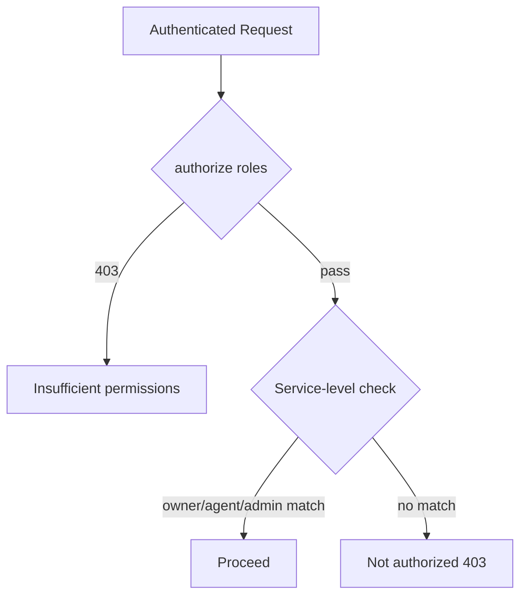

# Roles & Permissions

Buytly uses a **single-role RBAC model**: each user has exactly one role on their `User` document. Roles are defined in `server/src/shared/constants.js`:

| Constant       | Value    |
| -------------- | -------- |
| `ROLES.BUYER`  | `buyer`  |
| `ROLES.SELLER` | `seller` |
| `ROLES.AGENT`  | `agent`  |
| `ROLES.ADMIN`  | `admin`  |

Roles are **not stacked** — a seller does not inherit buyer route permissions, even though sellers can use favorites, saved searches, and the dashboard. Some endpoints are explicitly buyer-only.

See also: [auth-flow.md](./auth-flow.md) for JWT lifecycle and the summary permissions matrix.

---

## How roles are stored and enforced

### Database

- Field: `User.role` — enum of all four roles, default `buyer`
- Indexed for admin queries and analytics

### JWT

Access token payload includes `sub` (user ID) and `role`. On each request, `authenticate` reloads the user from MongoDB by `sub` and sets `req.user`.

**Authorization uses `req.user.role` from the database**, not the JWT claim. Admin role changes take effect on the next authenticated request.

### Middleware

`authorize(...roles)` in `server/src/middleware/auth.js` is a **route-level gate**. It returns `403 Insufficient permissions` when `req.user.role` is not in the allowed list.

Many endpoints add a **second layer** in services — ownership, party membership, or resource state (e.g. `canManageProperty`, `booking.agentId.equals(user._id)`).

---

## Role assignment

| How role is set                     | Allowed values             | Notes                                                     |
| ----------------------------------- | -------------------------- | --------------------------------------------------------- |
| `POST /auth/register`               | `buyer`, `seller`, `agent` | Defaults to `buyer`. **`admin` cannot be self-assigned.** |
| `POST /auth/google` (first sign-up) | `buyer`, `seller`, `agent` | Optional; only applied on **new** Google accounts         |
| `PATCH /admin/users/:id/role`       | All four roles             | Admin only                                                |
| Seed script                         | All four                   | e.g. `admin@buytly.demo`                                  |

When a user registers (or first Google sign-up) as **`agent`**, an `AgentProfile` is created automatically.

**Note:** Admin role promotion via `PATCH /admin/users/:id/role` only updates `User.role`. It does **not** create an `AgentProfile`. The agent service lazy-creates one on first profile access, but the public agent directory depends on `AgentProfile` existing.

---

## Buyer (`buyer`)

**Purpose:** End users searching for property, requesting visits, and initiating purchases or rentals.

### Capabilities

| Area           | What buyers can do                                                    |
| -------------- | --------------------------------------------------------------------- |
| Browse         | View public active/sold/rented listings                               |
| Favorites      | Add/remove favorites (any authenticated user)                         |
| Saved searches | Manage saved searches on profile                                      |
| Bookings       | Create visit requests, view own bookings, cancel pending ones         |
| Transactions   | Initiate buy/rent transactions, view transactions they participate in |
| Reviews        | Submit one review per active property                                 |
| Profile        | Update own profile, notification prefs, avatar                        |

### Route-level blocks

- Creating or managing listings (`seller`, `agent`, `admin` only)
- Approving/rejecting bookings
- Approving transaction status changes
- Agent profile endpoints (`/agents/me`)
- Admin panel (`/admin/*`)

### Booking contact assignment

When a buyer books a visit, the listing contact is `property.agentId || property.ownerId`. The seller (owner) receives the booking when no agent is assigned to the listing.

---

## Seller (`seller`)

**Purpose:** Property owners who list and sell/rent their own properties without being licensed agents.

### Listing capabilities

- Create properties — `ownerId` is set to the seller's user ID
- List, update, delete, restore, upload media/floor plans on owned or assigned listings
- View reviews on managed listings (`GET /properties/mine/reviews`)

On create, `agentId` is only set if explicitly passed in the payload (to assign a licensed agent). Otherwise the seller is both owner and listing contact.

### Moderation (non-admin)

- Submitting `active` or `pending` → stored as **`pending`** for admin review
- Default on create without status → `draft`
- Cannot set `sold`, `rented`, or `archived` directly — use completed transactions or admin action
- Material changes to an active listing re-trigger pending review

### Bookings and transactions

- Route access: allowed on agent booking endpoints
- Service check: can approve bookings **only if** `booking.agentId` equals their user ID (owner when no agent on property)
- Can update transaction status when they are `transaction.sellerId`

### Buyer-route restrictions

Sellers **cannot** use buyer-only routes:

- `POST /bookings`
- `POST /bookings/:id/cancel`
- `POST /transactions`

---

## Agent (`agent`)

**Purpose:** Licensed professionals who manage listings, maintain a public profile, and handle buyer interactions.

### Agent-specific features

| Feature            | Details                                                       |
| ------------------ | ------------------------------------------------------------- |
| `AgentProfile`     | License, agency, bio, specialties, city, rating, review count |
| Public directory   | `GET /agents`, `GET /agents/:id`                              |
| Self-assignment    | On property create, `agentId` defaults to the agent's user ID |
| Profile management | `GET/PATCH /agents/me` (agent role required)                  |

### Listing management

Same route access as seller. Service-level `canManageProperty` grants access when the user is:

- Admin, **or**
- `property.ownerId`, **or**
- `property.agentId`

An agent can manage listings they are assigned to even if they did not create them.

### Bookings and transactions

- List incoming bookings when they are the assigned listing contact
- Approve/reject/complete bookings where `booking.agentId` matches their ID
- Update transaction status when they are `transaction.agentId`

### Seller vs agent

|                          | Seller                       | Agent                                   |
| ------------------------ | ---------------------------- | --------------------------------------- |
| Public agent page        | No                           | Yes                                     |
| Auto `agentId` on create | No (unless specified)        | Yes (self)                              |
| `/agents/me` endpoints   | 403                          | Allowed                                 |
| Typical use case         | Owner listing their own home | Professional managing multiple listings |

Same buyer-route restrictions as seller (cannot create bookings or initiate transactions via buyer endpoints).

---

## Admin (`admin`)

**Purpose:** Platform operator — moderation, user management, analytics, and override powers.

**Cannot self-register.** Must be seeded or promoted by another admin.

All `/admin/*` routes require `authenticate` + `authorize(ROLES.ADMIN)`.

### Admin-only capabilities

| Endpoint area                          | Powers                                                     |
| -------------------------------------- | ---------------------------------------------------------- |
| `GET /admin/users`                     | List/filter users (including soft-deleted via `?deleted=`) |
| `GET /admin/users/:id`                 | User detail with related counts                            |
| `PATCH /admin/users/:id/status`        | Activate/deactivate accounts                               |
| `PATCH /admin/users/:id/role`          | Change any user's role                                     |
| `GET /admin/properties`                | All listings including draft/pending/archived              |
| `PATCH /admin/properties/:id/moderate` | Set any property status                                    |
| `GET /admin/analytics`                 | Platform KPIs                                              |

### Property superpowers

- Set any status directly without going through transactions
- View soft-deleted properties (non-admins filter `deletedAt: null`)
- Bypass moderation — `active` stays `active`
- Edit terminal listings (sold/rented/archived) that non-admins cannot

### Cross-cutting overrides

- `canManageProperty` — any property
- `canViewNonActiveProperty` — draft/pending/archived listings
- Booking/transaction status — any booking or transaction
- Review deletion — any review (not just own)

Admins pass listing-role checks at the route level and see listing management UI on the client. They do not get a public agent profile unless their role is also `agent`.

---

## Two-layer authorization

**Example — update property:**

1. Route: must be `seller`, `agent`, or `admin`
2. Service: must pass `canManageProperty(property, user)`

**Example — update booking status:**

1. Route: must be `seller`, `agent`, or `admin`
2. Service: must be admin **or** the booking's `agentId` (listing contact)

---

## Property visibility by role

| Listing status            | Public                 | Buyer   | Owner/Agent           | Admin       |
| ------------------------- | ---------------------- | ------- | --------------------- | ----------- |
| `active`                  | Visible                | Visible | Visible               | Visible     |
| `pending`, `draft`        | 404                    | 404     | Visible               | Visible     |
| `sold`, `rented`          | Visible in list filter | Visible | Visible               | Visible     |
| `archived` / soft-deleted | Hidden                 | Hidden  | Owner/agent via trash | Full access |

---

## Client-side role handling

Helpers in `client/src/lib/auth/roles.js`:

- `LISTING_ROLES`: `seller`, `agent`, `admin`
- `canManageListings(role)`: true for listing roles

UI guards (UX only — server enforces authorization):

| Component                       | Rule                                                             |
| ------------------------------- | ---------------------------------------------------------------- |
| `RequireAuth`                   | Any logged-in user for dashboard shell                           |
| `RequireListingRole`            | Redirects non-listing roles from add/edit property pages         |
| `RequireAdmin`                  | Redirects non-admins from admin pages                            |
| `getDashboardNavSections(role)` | Listing nav for seller/agent/admin; admin section for admin only |

Sign-up offers `buyer`, `seller`, `agent` — not `admin`.

---

## Permissions matrix

| Action                       | buyer | seller | agent | admin     |
| ---------------------------- | ----- | ------ | ----- | --------- |
| View public properties       | Yes   | Yes    | Yes   | Yes       |
| Favorites & saved searches   | Yes   | Yes    | Yes   | Yes       |
| Write property reviews       | Yes   | Yes    | Yes   | Yes       |
| Create listings              | —     | Yes    | Yes   | Yes       |
| Manage own/assigned listings | —     | Yes\*  | Yes\* | Yes (all) |
| Direct publish to `active`   | —     | —\*\*  | —\*\* | Yes       |
| Request visit bookings       | Yes   | —      | —     | —         |
| Approve/reject bookings      | —     | Yes†   | Yes†  | Yes       |
| Initiate transactions        | Yes   | —      | —     | —         |
| Approve transactions         | —     | Yes‡   | Yes‡  | Yes       |
| Agent public profile         | —     | —      | Yes   | —§        |
| Admin panel & analytics      | —     | —      | —     | Yes       |
| User management              | —     | —      | —     | Yes       |
| Listing moderation           | —     | —      | —     | Yes       |

\* Requires ownership (`ownerId`) or assignment (`agentId`)

\*\* Non-admins submit as `pending` for review

† Only when they are the booking's listing contact (`agentId` on booking)

‡ As `sellerId` or `agentId` on the transaction

§ Admins do not get a public agent profile unless role is also `agent`

---

## Design notes

1. **Single role, not multi-role** — choose at registration or get changed by admin.
2. **Role ≠ ownership** — being a seller does not let you edit every listing.
3. **Listing contact abstraction** — bookings use `agentId` to mean "who handles this request" (owner or actual agent).
4. **Admin is all-powerful at service layer** — bypasses moderation, visibility, and ownership checks in most services.
5. **Client guards are not security** — API `authorize()` + service checks are the real enforcement.
6. **Role changes are immediate in API** — `authenticate` reads from DB; JWT payload role is unused for authorization.
